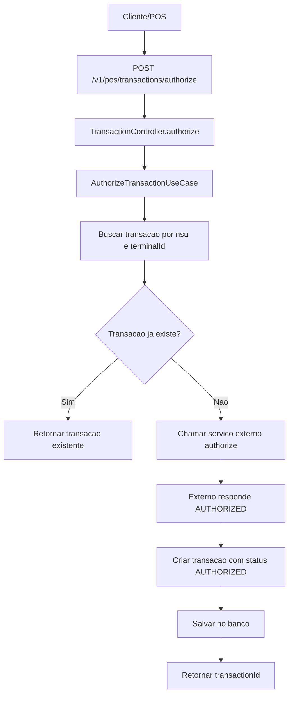
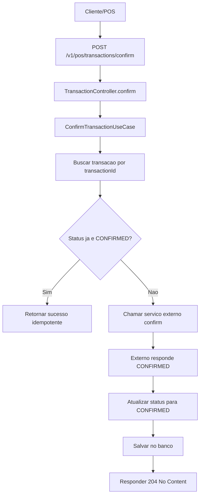
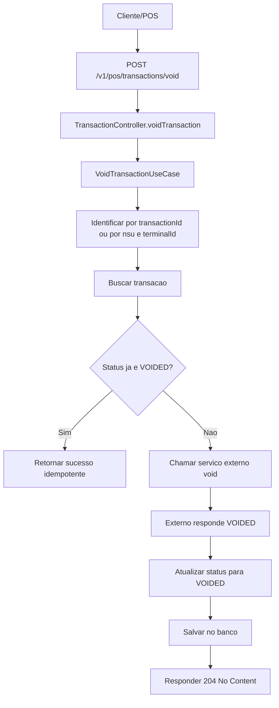
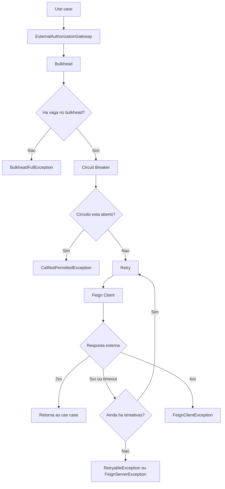
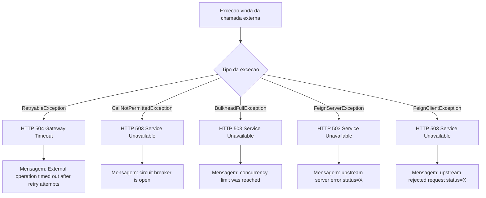
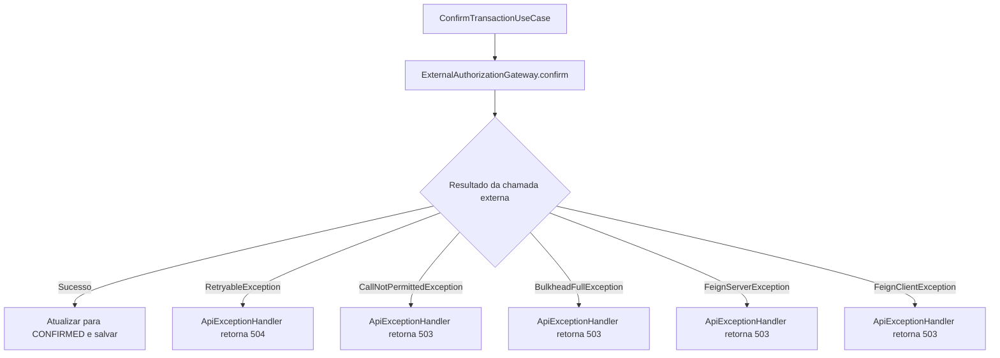
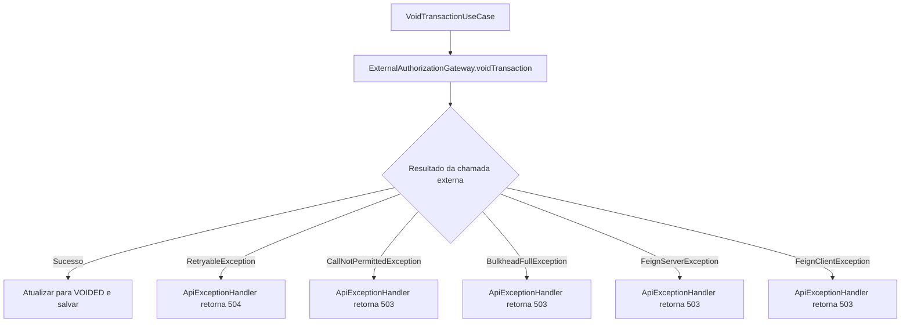

# pos-transaction-service

API Kotlin/Spring Boot para fluxo de transações de POS com três operações:

- `authorize`
- `confirm`
- `void`

A aplicação persiste transações em PostgreSQL, chama um serviço externo via Feign e aplica resiliência com Resilience4j (`retry`, `circuit breaker` e `bulkhead`).

## Stack

- Java 24
- Kotlin 2.2
- Spring Boot 4
- Spring Web MVC
- Spring Data JPA
- Flyway
- OpenFeign
- Resilience4j
- PostgreSQL
- WireMock
- OpenTelemetry / Prometheus / Jaeger

## Endpoints da API

Base path: `/v1/pos/transactions`

- `POST /authorize`
- `POST /confirm`
- `POST /void`

Documentação OpenAPI local:

- Swagger UI: `http://localhost:8080/swagger-ui.html`
- OpenAPI JSON: `http://localhost:8080/api-docs`

## Requisitos

- Java 24
- Docker e Docker Compose

## Como subir localmente

### 1. Suba as dependências locais

O projeto já tem um compose com:

- PostgreSQL
- WireMock
- Jaeger
- OpenTelemetry Collector
- Prometheus

Suba tudo com:

```bash
docker compose -f docker/docker-compose.yml up -d
```

Se quiser derrubar depois:

```bash
docker compose -f docker/docker-compose.yml down
```

### 2. Carregue as variáveis locais

O projeto possui um arquivo [variables.local.env](/Users/leonardofonsecaohashi/git/pos-transaction-service/variables.local.env:1) com os valores esperados para desenvolvimento local.

No terminal:

```bash
set -a
source variables.local.env
set +a
```

### 3. Suba a aplicação

Recomendado para ambiente local, porque habilita o interceptor de cenário do mock externo:

```bash
SPRING_PROFILES_ACTIVE=local ./gradlew bootRun
```

Sem profile `local` ou `dev`, a aplicação sobe normalmente, mas o mecanismo de cenários do WireMock não será injetado no client Feign.

## Componentes locais

Depois de subir tudo:

- API: `http://localhost:8080`
- PostgreSQL: `localhost:5432`
- WireMock: `http://localhost:8089`
- Jaeger UI: `http://localhost:16686`
- Prometheus: `http://localhost:9090`

## Fluxo local com WireMock

O client externo da aplicação aponta para:

- `POST /external/transactions/authorize`
- `POST /external/transactions/confirm`
- `POST /external/transactions/void`

Em ambiente local, o compose sobe um WireMock em `http://localhost:8089`, e o Feign usa `EXTERNAL_CLIENT_BASE_URL` para chamar esse mock.

Os mappings ficam em [docker/wiremock/mappings](/Users/leonardofonsecaohashi/git/pos-transaction-service/docker/wiremock/mappings:1).

### Resposta padrão

Sem cenário configurado, o WireMock responde:

- `authorize` com sucesso
- `confirm` com sucesso
- `void` com sucesso

### Como forçar cenários no mock

Em profile `local` ou `dev`, o projeto registra um `RequestInterceptor` que injeta o header `X-Mock-Scenario` nas chamadas externas, com base nas propriedades:

- `external.mock.scenarios.authorize`
- `external.mock.scenarios.confirm`
- `external.mock.scenarios.void`

Na prática, você pode subir a aplicação assim:

```bash
SPRING_PROFILES_ACTIVE=local \
EXTERNAL_MOCK_SCENARIOS_AUTHORIZE=timeout \
EXTERNAL_MOCK_SCENARIOS_CONFIRM=error \
EXTERNAL_MOCK_SCENARIOS_VOID=timeout \
./gradlew bootRun
```

Cenários disponíveis hoje nos mappings:

- `authorize`: `error`, `timeout`
- `confirm`: `error`, `timeout`
- `void`: `error`, `timeout`

Comportamento:

- `error`: o WireMock devolve `500`
- `timeout`: o WireMock devolve com atraso alto o suficiente para estourar o timeout do client

## Exemplos de chamadas locais

### Authorize

```bash
curl -X POST 'http://localhost:8080/v1/pos/transactions/authorize' \
  -H 'Content-Type: application/json' \
  -d '{
    "nsu": "123456",
    "amount": 10.50,
    "terminalId": "T-1000"
  }'
```

Resposta esperada:

```json
{
  "transactionId": "..."
}
```

Observação:

- se já existir transação para `(nsu, terminalId)`, o fluxo é idempotente e retorna a mesma transação

### Confirm

```bash
curl -X POST 'http://localhost:8080/v1/pos/transactions/confirm' \
  -H 'Content-Type: application/json' \
  -d '{
    "transactionId": "SEU_TRANSACTION_ID"
  }'
```

Resposta esperada:

- `204 No Content`

### Void por transactionId

```bash
curl -X POST 'http://localhost:8080/v1/pos/transactions/void' \
  -H 'Content-Type: application/json' \
  -d '{
    "transactionId": "SEU_TRANSACTION_ID"
  }'
```

Resposta esperada:

- `204 No Content`

### Void por nsu + terminalId

```bash
curl -X POST 'http://localhost:8080/v1/pos/transactions/void' \
  -H 'Content-Type: application/json' \
  -d '{
    "nsu": "123456",
    "terminalId": "T-1000"
  }'
```

Resposta esperada:

- `204 No Content`

## Exemplos para testar erro do mock externo

### Authorize com timeout externo

```bash
SPRING_PROFILES_ACTIVE=local \
EXTERNAL_MOCK_SCENARIOS_AUTHORIZE=timeout \
./gradlew bootRun
```

Depois:

```bash
curl -X POST 'http://localhost:8080/v1/pos/transactions/authorize' \
  -H 'Content-Type: application/json' \
  -d '{
    "nsu": "timeout-1",
    "amount": 10.50,
    "terminalId": "T-1000"
  }'
```

Resultado esperado:

- `504 Gateway Timeout`

### Confirm com erro externo

```bash
SPRING_PROFILES_ACTIVE=local \
EXTERNAL_MOCK_SCENARIOS_CONFIRM=error \
./gradlew bootRun
```

Depois:

```bash
curl -X POST 'http://localhost:8080/v1/pos/transactions/confirm' \
  -H 'Content-Type: application/json' \
  -d '{
    "transactionId": "SEU_TRANSACTION_ID"
  }'
```

Resultado esperado:

- `503 Service Unavailable`

## Fluxogramas de sucesso

Os diagramas abaixo mostram apenas o caminho feliz de cada operação.

### Authorize



### Confirm



### Void



## Fluxogramas de resiliência

Os diagramas abaixo mostram o comportamento da camada externa protegida por Resilience4j.

Observação:

- o mesmo padrão é aplicado para `authorize`, `confirm` e `void`
- o que muda é o nome lógico da operação usado nas mensagens: `authorization`, `confirmation` e `void`

### Chamada externa com retry, circuit breaker e bulkhead



### Mapeamento das falhas de resiliência para HTTP



### Resiliência no caminho do authorize


### Resiliência no caminho do confirm



### Resiliência no caminho do void



## Testes

### Rodar a suíte completa

```bash
./gradlew test
```

### Rodar só um conjunto específico

```bash
./gradlew test --tests br.com.ohashi.postransactionservice.application.core.usecases.AuthorizeTransactionUseCaseTest
```

### Sobre testes com Docker

Os testes de integração e de contexto que dependem de Testcontainers foram marcados para serem ignorados automaticamente quando Docker não estiver disponível.

Isso significa:

- com Docker disponível: eles executam normalmente
- sem Docker: a suíte continua útil e não falha por ambiente

## Como os testes estão organizados

- testes unitários de use case
- testes unitários de adapters
- testes unitários de controller/handler/request
- testes de integração com Spring + banco

Arquivos relevantes:

- [TransactionAuthorizationIntegrationTest.kt](/Users/leonardofonsecaohashi/git/pos-transaction-service/src/test/kotlin/br/com/ohashi/postransactionservice/integration/TransactionAuthorizationIntegrationTest.kt:1)
- [TransactionFlowIntegrationTest.kt](/Users/leonardofonsecaohashi/git/pos-transaction-service/src/test/kotlin/br/com/ohashi/postransactionservice/integration/TransactionFlowIntegrationTest.kt:1)

## Variáveis do `variables.local.env`

Arquivo: [variables.local.env](/Users/leonardofonsecaohashi/git/pos-transaction-service/variables.local.env:1)

### Aplicação

- `SERVICE_PORT`: porta em que a API sobe localmente. Exemplo: `8080`.
- `APP_VERSION`: versão exibida no `actuator/info` e usada para identificar o build em ambiente local.

### Banco

- `DATABASE_HOST`: host do PostgreSQL usado pela aplicação.
- `DATABASE_PORT`: porta do PostgreSQL.
- `DATABASE_NAME`: nome do banco onde a tabela de transações será criada pelo Flyway.
- `DATABASE_USERNAME`: usuário de acesso ao banco.
- `DATABASE_PASSWORD`: senha do usuário do banco.

### Client externo

- `EXTERNAL_CLIENT_BASE_URL`: URL base do autorizador externo; no local aponta para o WireMock em `http://localhost:8089`.
- `EXTERNAL_CLIENT_CONNECT_TIMEOUT_MILLIS`: tempo máximo para abrir conexão com o serviço externo.
- `EXTERNAL_CLIENT_READ_TIMEOUT_MILLIS`: tempo máximo para esperar a resposta do serviço externo depois de conectar.

### Telemetria

- `OTLP_METRICS_EXPORT_ENABLED`: liga ou desliga a exportação de métricas via OTLP.
- `OTLP_METRICS_EXPORT_URL`: endpoint para onde as métricas OTLP serão enviadas.
- `OTLP_TRACING_EXPORT_ENABLED`: liga ou desliga a exportação de traces via OTLP.
- `OTLP_TRACING_ENDPOINT`: endpoint para envio dos traces.
- `TRACING_SAMPLING_PROBABILITY`: percentual de traces coletados. `1.0` significa coletar tudo.

### Retry do authorize

- `EXTERNAL_AUTHORIZE_RETRY_MAX_ATTEMPTS`: número máximo de tentativas para chamada externa de `authorize`.
- `EXTERNAL_AUTHORIZE_RETRY_WAIT_DURATION`: espera inicial entre tentativas.
- `EXTERNAL_AUTHORIZE_RETRY_ENABLE_EXPONENTIAL_BACKOFF`: habilita aumento progressivo do tempo de espera.
- `EXTERNAL_AUTHORIZE_RETRY_EXPONENTIAL_BACKOFF_MULTIPLIER`: multiplicador do backoff exponencial.
- `EXTERNAL_AUTHORIZE_RETRY_EXPONENTIAL_MAX_WAIT_DURATION`: limite máximo de espera entre tentativas.
- `EXTERNAL_AUTHORIZE_RETRY_ENABLE_RANDOMIZED_WAIT`: adiciona jitter para evitar rajadas sincronizadas.
- `EXTERNAL_AUTHORIZE_RETRY_RANDOMIZED_WAIT_FACTOR`: intensidade da aleatorização do tempo de espera.

### Retry do confirm

- `EXTERNAL_CONFIRM_RETRY_MAX_ATTEMPTS`: número máximo de tentativas para chamada externa de `confirm`.
- `EXTERNAL_CONFIRM_RETRY_WAIT_DURATION`: espera inicial entre tentativas.
- `EXTERNAL_CONFIRM_RETRY_ENABLE_EXPONENTIAL_BACKOFF`: habilita aumento progressivo do tempo de espera.
- `EXTERNAL_CONFIRM_RETRY_EXPONENTIAL_BACKOFF_MULTIPLIER`: multiplicador do backoff exponencial.
- `EXTERNAL_CONFIRM_RETRY_EXPONENTIAL_MAX_WAIT_DURATION`: limite máximo de espera entre tentativas.
- `EXTERNAL_CONFIRM_RETRY_ENABLE_RANDOMIZED_WAIT`: adiciona jitter ao retry.
- `EXTERNAL_CONFIRM_RETRY_RANDOMIZED_WAIT_FACTOR`: fator de aleatorização do retry.

### Retry do void

- `EXTERNAL_VOID_RETRY_MAX_ATTEMPTS`: número máximo de tentativas para chamada externa de `void`.
- `EXTERNAL_VOID_RETRY_WAIT_DURATION`: espera inicial entre tentativas.
- `EXTERNAL_VOID_RETRY_ENABLE_EXPONENTIAL_BACKOFF`: habilita aumento progressivo do tempo de espera.
- `EXTERNAL_VOID_RETRY_EXPONENTIAL_BACKOFF_MULTIPLIER`: multiplicador do backoff exponencial.
- `EXTERNAL_VOID_RETRY_EXPONENTIAL_MAX_WAIT_DURATION`: limite máximo de espera entre tentativas.
- `EXTERNAL_VOID_RETRY_ENABLE_RANDOMIZED_WAIT`: adiciona jitter ao retry.
- `EXTERNAL_VOID_RETRY_RANDOMIZED_WAIT_FACTOR`: fator de aleatorização do retry.

### Circuit breaker do authorize

- `EXTERNAL_AUTHORIZE_CB_SLIDING_WINDOW_SIZE`: tamanho da janela usada para calcular falhas do `authorize`.
- `EXTERNAL_AUTHORIZE_CB_MINIMUM_CALLS`: quantidade mínima de chamadas antes de avaliar abertura do circuito.
- `EXTERNAL_AUTHORIZE_CB_FAILURE_RATE_THRESHOLD`: percentual de falha que abre o circuito.
- `EXTERNAL_AUTHORIZE_CB_WAIT_DURATION_IN_OPEN_STATE`: tempo que o circuito fica aberto antes de testar novamente.
- `EXTERNAL_AUTHORIZE_CB_PERMITTED_CALLS_IN_HALF_OPEN`: quantas chamadas de teste podem passar em half-open.

### Circuit breaker do confirm

- `EXTERNAL_CONFIRM_CB_SLIDING_WINDOW_SIZE`: tamanho da janela usada para calcular falhas do `confirm`.
- `EXTERNAL_CONFIRM_CB_MINIMUM_CALLS`: quantidade mínima de chamadas antes de avaliar abertura do circuito.
- `EXTERNAL_CONFIRM_CB_FAILURE_RATE_THRESHOLD`: percentual de falha que abre o circuito.
- `EXTERNAL_CONFIRM_CB_WAIT_DURATION_IN_OPEN_STATE`: tempo que o circuito fica aberto antes de testar novamente.
- `EXTERNAL_CONFIRM_CB_PERMITTED_CALLS_IN_HALF_OPEN`: quantas chamadas de teste podem passar em half-open.

### Circuit breaker do void

- `EXTERNAL_VOID_CB_SLIDING_WINDOW_SIZE`: tamanho da janela usada para calcular falhas do `void`.
- `EXTERNAL_VOID_CB_MINIMUM_CALLS`: quantidade mínima de chamadas antes de avaliar abertura do circuito.
- `EXTERNAL_VOID_CB_FAILURE_RATE_THRESHOLD`: percentual de falha que abre o circuito.
- `EXTERNAL_VOID_CB_WAIT_DURATION_IN_OPEN_STATE`: tempo que o circuito fica aberto antes de testar novamente.
- `EXTERNAL_VOID_CB_PERMITTED_CALLS_IN_HALF_OPEN`: quantas chamadas de teste podem passar em half-open.

### Bulkhead do authorize

- `EXTERNAL_AUTHORIZE_BULKHEAD_MAX_CONCURRENT_CALLS`: número máximo de chamadas simultâneas para o externo de `authorize`.
- `EXTERNAL_AUTHORIZE_BULKHEAD_MAX_WAIT_DURATION`: quanto tempo uma chamada espera por vaga no bulkhead antes de falhar.

### Bulkhead do confirm

- `EXTERNAL_CONFIRM_BULKHEAD_MAX_CONCURRENT_CALLS`: número máximo de chamadas simultâneas para o externo de `confirm`.
- `EXTERNAL_CONFIRM_BULKHEAD_MAX_WAIT_DURATION`: quanto tempo uma chamada espera por vaga no bulkhead antes de falhar.

### Bulkhead do void

- `EXTERNAL_VOID_BULKHEAD_MAX_CONCURRENT_CALLS`: número máximo de chamadas simultâneas para o externo de `void`.
- `EXTERNAL_VOID_BULKHEAD_MAX_WAIT_DURATION`: quanto tempo uma chamada espera por vaga no bulkhead antes de falhar.

## Regras úteis do contrato HTTP

### Authorize

Payload:

```json
{
  "nsu": "123456",
  "amount": 10.50,
  "terminalId": "T-1000"
}
```

Validações:

- `nsu` obrigatório, máximo 20 caracteres
- `amount` obrigatório, positivo, até 10 inteiros e 2 casas decimais
- `terminalId` obrigatório

### Confirm

Payload:

```json
{
  "transactionId": "..."
}
```

Validações:

- `transactionId` obrigatório

### Void

Payload aceito em uma das formas:

```json
{
  "transactionId": "..."
}
```

ou:

```json
{
  "nsu": "123456",
  "terminalId": "T-1000"
}
```

Regra:

- informe `transactionId`
- ou informe `nsu` e `terminalId`
- não envie os dois formatos juntos
